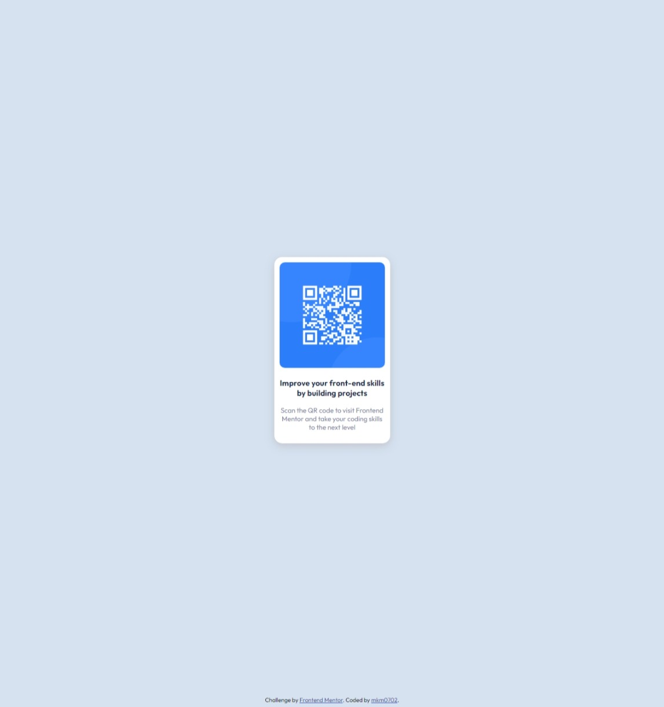

# Frontend Mentor - QR code component solution

This is a solution to the [QR code component challenge on Frontend Mentor](https://www.frontendmentor.io/challenges/qr-code-component-iux_sIO_H). Frontend Mentor challenges help you improve your coding skills by building realistic projects.

## Table of contents

- [Screenshot](#screenshot)
- [Links](#links)
- [My process](#my-process)
  - [Built with](#built-with)
  - [Useful resources](#useful-resources)
- [Author](#author)

### Screenshot

### Links

- Solution URL: [Add solution URL here](https://your-solution-url.com)
- Live Site URL: [Add live site URL here](https://your-live-site-url.com)

## My process

- Just build basic html.
- After that I used flexbox to center the container.
- At last, I applied all the fonts and padding accordingly.

### Built with

- Semantic HTML5 markup
- CSS custom properties
- Flexbox
- Css Box Shadow

### Useful resources

- [Example resource 1](https://www.w3schools.com/css/) - This helped me for finding the relevant syntax reason.

## Author

- Website - [Manish Kumar Milan](https://mkm0702.github.io)
- Frontend Mentor - [@mkm0702](https://www.frontendmentor.io/profile/mkm0702)
- Twitter - [@mkm16207](https://www.twitter.com/yourusername)
